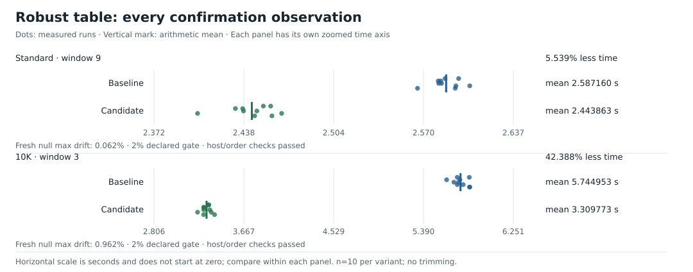

# 4. A table built for repeated names

[`f8a90a5`](data/history.md#f8a90a5) replaces the old table with 32,768 entries.
Each entry stores its statistics directly, without another pointer.
A fingerprint is a number calculated from name bytes.
The new table uses complete name fingerprints and a small function for common lookups.
The table also owns copies of its stored names.

This change gives the largest 10K improvement in the documented Linux sequence.
Runtime falls by 42.39% on 10K and 5.54% on standard.

## The profile points at lookup

The [post-SWAR profile review](../../EXPERIMENTS.md#post-swar-profile-review)
attributes 31.01% of standard samples and 65.87% of 10K samples to the old
`simpleMap.pos` plus `simpleMap.get`.
String equality accounts for 5.19% / 22.86%.
These proportions describe sampled CPU activity in the retained runs.
They do not give elapsed time that we can subtract from later runs.

The old lookup follows a bucket to a slice and walks its entries.
It compares names, then follows a pointer to the statistics.
A descriptor records the name location and length.
The replacement stores the name descriptor, statistics, and fingerprint together:

```go
type flatEntry struct {
    name  stationName // 16-byte string descriptor on 64-bit Go
    stats stats       // 16 bytes: sum, min, max, count
    hash  uint64      // 8 bytes
}                     // total: 40 bytes
```

“Inline” means that these values sit inside the entry.
The statistics and name descriptor are inline.
The program allocates the string bytes separately.
Each worker stores $32768\times40=1{,}310{,}720$ bytes of entries on the measured 64-bit layout.

Occupancy is the proportion of entries that contain names.
At 10,000 names, occupancy is $10000/32768\approx30.52\%$.
The remaining entries leave room to search after collisions.

## Hash the complete name

Little-endian order puts the first byte in the lowest bits.
Zero padding fills unused bytes with zero.
For names up to eight bytes, `stationWord` packs the complete name into a 64-bit integer with this order and padding:

```text
"Oslo" → bytes 4f 73 6c 6f → 0x000000006f6c734f
```

The short-name fingerprint is:

$$
h=\operatorname{rotl}_{64}(w\times\mathtt{0x517cc1b727220a95},17),
$$

Multiplication wraps modulo $2^{64}$, so it keeps only 64 bits.
Rotation moves bits past one end back into the other.
For Oslo, the expression gives `0xa618e03c65f6a782`.

The multiplier is odd.
Its multiplicative inverse is a number that reverses multiplication.
That inverse exists modulo $2^{64}$ because the odd multiplier shares no factor with that power of two.
Multiplication therefore rearranges the possible 64-bit words without duplicates.
Rotation also rearranges them without duplicates.

Consider names with the same length, up to eight bytes.
Different names cannot produce the same full fingerprint.
The multiplication and rotation are both reversible.

Length still matters.
`"A"` and `"A\x00"` both become `0x41` after zero padding, but their lengths differ.
The hash is the fingerprint used for lookup.
The lookup makes sure that both the hash and length match.
For short names, these two values identify the name exactly because the mapping is reversible.

For long names, the hash mixes every eight-byte group and the final padded bytes.
For example, `abcdefghX` and `abcdefghY` share the first word but differ in the remaining byte.
There are more possible long names than 64-bit values.
For a long-name hash match, the lookup must also compare the complete strings.

## Choose a home slot and probe forward

A slot is one entry position in the table.
The home slot is the first position searched for a name.
The table size is a power of two, so the home slot is:

```go
pos := uint32(hash) & 32767 // keep the lowest 15 bits
```

For Oslo, `0xa782 & 0x7fff = 0x2782 = 10114`.
A collision occurs when names share a home slot.
Reducing the full fingerprint to 15 bits allows collisions.
Different full fingerprints can share a home slot.

Open addressing stores colliding names in other table entries.
A probe examines a candidate entry during lookup.
On a collision, the lookup probes successive entries:

```text
home 32767 occupied by another name
     ↓
slot 0 occupied by another name
     ↓
slot 1 empty: insert here
```

The operation `(pos+1)&32767` wraps from 32767 to zero.
Each worker can insert names in a different order.
This can put the same station in different final slots.
Merging combines the statistics from different worker tables.
The merge must look up each name in the destination table.
It cannot reuse the slot from the source table.

[The wraparound merge test](../../hotpath_test.go) creates this situation.
The tables place the same names in different slots.
The merge must still combine the matching stations.

## Keep the common lookup small

The first replacement prototype improved the extended corpus but slowed standard by 3.28%.
Better collision handling does not guarantee a faster complete program.
A more expensive lookup for common repeated names can offset that benefit.

The accepted version splits two paths:

```go
st := out.homeHit(name, hash) // check only the initial slot
if st == nil {
    st = out.findSlow(name, hash) // collisions or insertion
}
updateStats(st, value)
```

`homeHit` examines one entry.
The larger insertion and probe loop stays in `findSlow`.
Inlining copies a function body into its caller.
The compiler can inline the small common function into the row loop.
This removes the work of calling it separately.

“Hot” means code that the program runs frequently.
“Cold” means code that the program runs less often.
For example, the program inserts a new key on the cold path.
Here, these terms describe frequency, not temperature.

The split preserves the replacement prototype's hash and entry layout.
Three-way screening runs compared the old table, the replacement without the split, and the split version.
The final acceptance comparison uses the old production table and the split version.
It measures the complete accepted replacement.
It does not assign the entire gain to inlining.

## Clone once when a station is first seen

A borrowed name refers to bytes owned by the input chunk.
The parser initially returns a borrowed name.
When the table inserts a new station, it copies the name:

```go
entry.name = stationName(strings.Clone(string(name)))
```

The table owns the copied bytes.
Repeated rows use that stored key and allocate no new key string.
The number of copies depends on distinct stations per worker, not total observations.
The program can release an input chunk without losing its station names.
This ownership also permits [the later buffer pool](07-bounded-buffer-reuse.md) to reuse input memory.

## The measured result



| Corpus / window | Old table mean | Accepted table mean | Runtime reduction |
| --- | ---: | ---: | ---: |
| Standard / 9 | 2.587160 s | 2.443863 s | 5.539% |
| 10K / 3 | 5.744953 s | 3.309773 s | 42.388% |

Both comparisons have ten measured runs per variant.
Fresh null controls show maximum drift of 0.062% / 0.962%.
Live-host monitoring and the declared 2% tests for order effects pass.
Both inputs are fully resident in memory, and all outputs match exactly.
These comparisons use quiet periods on the Ryzen 7 5800X.
The earlier Mac profiles do not supply these measurements.

Tests make sure that fingerprints match, entries occupy 40 bytes, and keys own their bytes.
They also cover wraparound collisions, reverse insertion order, and merging.
The original acceptance record reports passing unit tests, race detection, `vet`, and ARM64 builds.
It also reports 28 small outputs, both full comparisons with reference output, and independent billion-row counts.

Evidence: [extracted observations](data/timings.json),
[accepted experiment record](../../EXPERIMENTS.md#accepted-robust-table-and-hotcold-split-2026-10-06),
[table tests](../../hotpath_test.go),
[source change](data/history.md#f8a90a5).

[← Previous](03-swar-separator-scan.md) · [Next: reuse the loaded word →](05-reusing-the-first-word.md)
