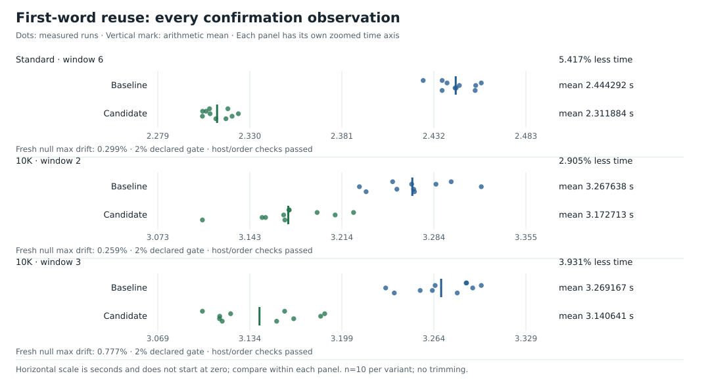

# 5. Keep the station word we already loaded

[`51e20a1`](data/history.md#51e20a1) adds the first station word to the parser's return value.
A word is a 64-bit integer.
Here, it contains up to eight name bytes.
The parser reads a row and returns its values.
The row loop hashes the returned word instead of loading the same name bytes again.
The table, fingerprint mapping, numeric decoder, and reader use the measured baseline versions.

## The old and new data flow

Before this change:

```text
input → load first eight bytes to scan for ';'
      → return name
      → load first name bytes again to hash them
      → lookup → update
```

After:

```text
input → load first eight bytes to scan for ';'
      → preserve and normalize that word
      → return name and word
      → hash cached word → lookup → update
```

XOR compares bits and sets one when they differ.
A delimiter is a character that separates fields.
The parser uses XOR to find the semicolon delimiter.
The parser saves the original loaded word as `firstWord` before the XOR operation.
It then searches with the temporary XOR result.

## A raw parser word is not always a name word

For `Oslo;1.2\n`, the load includes four name bytes, the semicolon, and part of the temperature.
The table needs a word that contains only name bytes.
The two words differ:

```text
Raw loaded word:  0x322e313b6f6c734f
Name length:      4 bytes
Required word:    0x000000006f6c734f
```

Hashing the raw word can give `Oslo;1.2` and `Oslo;9.9` different station identities.
A mask selects the bits to keep.
For names shorter than eight bytes, the following mask removes everything after the name:

$$
\text{mask}(n)=(1\ll8n)-1,\qquad 1\le n<8.
$$

For four bytes, the mask is `0x00000000ffffffff`:

```go
firstWord &= (uint64(1) << (separatorIdx * 8)) - 1
```

The result keeps only `4f 73 6c 6f`, exactly what `stationWord("Oslo")` produces.
For an eight-byte name, all loaded bytes belong to the name.
That case needs no mask.
Longer names also reuse the full first word.
Their hash then includes the remaining groups of bytes.

An input shorter than eight bytes cannot supply a safe eight-byte load.
In that case, the parser calls the existing `stationWord` helper.
The helper reads within the name and pads unused bytes with zeros.
For `A;0.0\n`, it returns `0x41`.
This fallback keeps the load within the input.

## Continue long hashing from the same state

The cached word must equal the old helper's result, bit for bit.
For `abcdefghX`, the first word is `0x6867666564636261`.
The long-name hash then mixes the remaining byte, `0x58`, padded with zeros.
It finishes with the same multiply and rotation as before.
The fingerprint remains `0x882cfcbff17ddf39`.

The table keeps the same station identities, home slots, and collision patterns.
A changed hash can alter performance by placing names in different slots.
This experiment keeps the mapping fixed.
Its comparison therefore measures the reuse of parser work.

The change removes the unused old `stationPos`.
Its only remaining caller was an obsolete benchmark.
That benchmark now measures the production fingerprint.
The acceptance result does not assign a separate performance gain to this cleanup.

## Follow one complete row

The teaching input `Oslo;-12.6\nParis;0.0\n` produces:

| Stage | Result |
| --- | --- |
| First 64-bit load | Name prefix plus `;-12` |
| Semicolon index | 4 |
| Normalized name word | `0x000000006f6c734f` |
| Scalar number decoder | `-126` tenths |
| Newline index | 10 |
| Parser return | `(10, "Oslo", -126, 0x6f6c734f)` |
| Fingerprint | `0xa618e03c65f6a782` |
| Home slot | 10114 |
| Next input view | Starts at byte 11: `Paris;0.0\n` |

For a new key, insertion copies `Oslo` into memory owned by the table.
`updateStats` sets count to 1, and sum, minimum, and maximum to `-126`.
An accumulator stores the running statistics for one station.
Later Oslo rows update the same accumulator.
The parser's returned name still borrows input memory.
Returning the extra integer does not change how long those borrowed bytes remain valid.

## The measured result, including the repeat



| Corpus / window | Baseline | Reuse | Runtime reduction |
| --- | ---: | ---: | ---: |
| Standard / 6 | 2.444292 s | 2.311884 s | 5.417% |
| 10K / 2 | 3.267638 s | 3.172713 s | 2.905% |
| 10K / 3, independent repeat | 3.269167 s | 3.140641 s | 3.931% |

The first 10K gain was below the declared 3% threshold for an independent repeat.
The experiment therefore repeated the comparison in a separate quiet period.
The table includes both complete results.
Each comparison has ten observations per variant and an independent null control.
Tests for order effects and live-host monitoring pass.
All outputs match exactly.

Instrumented runs collect CPU counters separately from the timed acceptance runs.
These counters show user instructions per row falling `273.409 → 254.401` on standard and `302.044 → 284.906` on 10K.
They support the explanation that the change removes work.
They do not supply the timed acceptance results.

Total allocation volume remains about 13.8 / 17.1 GB.
The reader still allocates a fresh input chunk for each read.
This version changes parser work rather than buffer allocation.

Tests cover name lengths 1–100, UTF-8 bytes, embedded NUL bytes, and names that differ in length.
They also cover shared first words, all temperature layouts, independence from following rows, and incomplete final bytes.
An independent packing helper supplies the expected word.
The comparison makes sure that the parser returns the same word as that helper.

Evidence: [extracted observations](data/timings.json),
[acceptance and diagnostics](../../EXPERIMENTS.md#accepted-parser-word-reuse-2026-10-06),
[parser-word tests](../../parser_word_test.go),
[source change](data/history.md#51e20a1).

[← Previous](04-robust-station-table.md) · [Next: the temperature word →](06-temperature-word-decoder.md)
