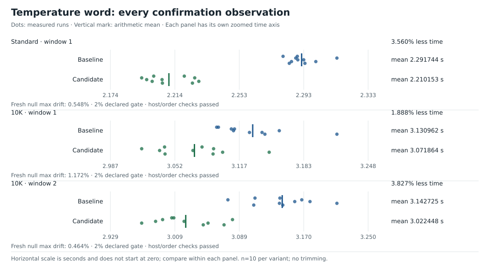

# 6. Turn a temperature word into integer tenths

[`ef7418a`](data/history.md#ef7418a) adds a temperature decoder that loads eight bytes within the input chunk.
A decoder turns temperature text into an integer.
A word is a 64-bit integer.
Here, it contains eight input bytes.

The decoder handles all four legal temperature layouts with one word load.
It finds the decimal point, records the sign, aligns the digits, and multiplies them.
Short final rows still use `parseNumber`.

We can explain the constants by tracing each operation.
The examples use the actual source expressions.
Our teaching input is `Oslo;-12.6\nParis;0.0\n`.

## Read eight bytes after the semicolon

The temperature word begins with these bytes:

| Offset | 0 | 1 | 2 | 3 | 4 | 5 | 6 | 7 |
| --- | --- | --- | --- | --- | --- | --- | --- | --- |
| Character | `-` | `1` | `2` | `.` | `6` | `\n` | `P` | `a` |
| Hex | `2d` | `31` | `32` | `2e` | `36` | `0a` | `50` | `61` |

Little-endian order puts the first byte in the lowest bits.
In that order, `temperatureWord = 0x61500a362e32312d`.
The load intentionally includes the first bytes of the following row when they are inside the same slice.
A mask selects the bits to keep.
The later digit mask removes the following-row bytes.

The bound is `len(data)-separatorIdx >= 9`.
That requires one semicolon plus at least eight following bytes.
It proves that the load stays within the input.
A final row such as `Oslo;-12.6\n` has only six bytes after the semicolon.
The scalar fallback reads individual digits instead of a word.
This complete row therefore uses that fallback.

## Step 1: locate the decimal point

Bit 0 is the lowest bit.
Each byte contains eight bits, numbered 0–7.
For ASCII digits (`0x30` through `0x39`), bit 4 is set.
For `.` (`0x2e`), bit 4 is clear.
The decimal point appears at byte 1, 2, or 3.

AND keeps bits set in both inputs.
In Go, `&` applies AND and unary `^` inverts bits.
A trailing-zero count locates the lowest set bit.
This expression examines only bit 4 at the three candidate positions:

```go
dotPos := bits.TrailingZeros64(^temperatureWord & 0x10101000)
```

`0x10101000` selects bit positions 12, 20, and 28.
These positions contain bit 4 of bytes 1, 2, and 3.
The mask omits byte 0, which can contain `-`.
The lowest selected clear bit identifies the first candidate for the decimal position.
For our word:

```text
~word & 0x10101000 = 0x0000000010000000
trailing-zero count = 28
dot byte = 28 / 8 = 3
```

The four forms resolve as follows:

| Temperature | Dot byte | `dotPos` | Alignment shift `28-dotPos` |
| --- | ---: | ---: | ---: |
| `1.2` | 1 | 12 | 16 |
| `12.6` | 2 | 20 | 8 |
| `-1.2` | 2 | 20 | 8 |
| `-12.6` | 3 | 28 | 0 |

The expression assumes the legal temperature layouts.
It does not test arbitrary numeric strings for validity.
Before it accepts a row, the parser makes sure that `dotPos <= 28` and that the expected newline is present.

The newline index relative to the whole row is:

$$
\text{newlineIdx}=\text{separatorIdx}+\lfloor\text{dotPos}/8\rfloor+3.
$$

The separator is at index 4, and the decimal point is at byte 3 of the temperature.
The formula adds these positions and three more bytes.
The result is `4+3+3=10`.

## Step 2: produce a sign mask

Byte zero contains either a digit with bit 4 set or `-` with bit 4 clear.
Inversion changes each bit to its opposite value.
The expression inverts the word, then shifts bit 4 to bit 63.
It converts the result to signed `int64`, then shifts right:

```go
signed := int64(^temperatureWord << 59) >> 63
```

An arithmetic right shift fills new positions with the sign bit.
An unsigned right shift fills them with zeros.
The expression therefore returns `0` for positive numbers and `-1` for negative numbers.

Two's complement is a way to represent signed integers.
To negate a value, it complements bits and adds one.
In that representation, `-1` contains all one bits.
This gives a mask that represents the sign.

For `-12.6`, `signed = -1`.
The expression `uint64(signed)&0xff` becomes `0xff`.
Its complement gives a mask that clears byte zero.
For a positive number, the same expression becomes zero.
Its complement keeps every byte.

## Step 3: remove the sign and align the digits

The source combines sign clearing, alignment, and digit selection:

```go
digits := ((temperatureWord & ^(uint64(signed) & 0xff)) <<
           (28 - dotPos)) & 0x0f000f0f00
```

The shift places the decimal point in byte 3 for every format.
A nibble is a group of four bits.
The digit mask keeps the low nibble of bytes 1, 2, and 4.
Those bytes contain the hundreds, tens, and units of the temperature in integer tenths.

The low nibble of an ASCII digit contains its numeric value.
For example, `'6' & 0x0f = 6`.
The mask therefore converts the selected ASCII digits into values.

For `-12.6` the trace is:

| Operation | Result |
| --- | --- |
| Original word | `61500a362e32312d` |
| Clear sign byte | `61500a362e323100` |
| Shift left by `28-28 = 0` | `61500a362e323100` |
| AND `0000000f000f0f00` | `0000000600020100` |

The surviving bytes in memory order are `00 01 02 00 06 00 00 00`.
The decimal, newline, and following-row bytes are gone.

For `1.2`, a shift of 16 puts `1` at byte 2 and `2` at byte 4.
Byte 1 is zero.
The same mask gives `0x0000000200010000`.
The missing hundreds digit therefore contributes zero.

## Step 4: a multiply combines the digits

Let $h,t,u$ represent the hundreds, tens, and units digits.
Each digit occupies a different byte position.
The masked word is:

$$
D=h\,2^8+t\,2^{16}+u\,2^{32}.
$$

The multiplier is:

$$
K=\mathtt{0x640a0001}=1+10\,2^{16}+100\,2^{24}.
$$

The products contributing at bit 32 are:

$$
(h\,2^8)(100\,2^{24})+
(t\,2^{16})(10\,2^{16})+
(u\,2^{32})(1)
=(100h+10t+u)\,2^{32}.
$$

That sum gives the required integer temperature.
A carry moves overflow into a higher bit position.
For legal digits, the other low products are too small to carry into bit 32.

The extra upper product $100t\,2^{40}$ becomes $100t\,2^8$ after the right shift by 32.
That value is a multiple of 1024.
The ten-bit mask removes it and the still-higher terms.
Magnitude means the value without its sign.
The maximum magnitude, 999, fits in ten bits.

```go
absolute := int64((digits * 0x640a0001) >> 32 & 0x3ff)
```

For `digits = 0x0000000600020100`:

```text
64-bit wrapped product = 0x583cc87e0a020100
(product >> 32) & 0x3ff = 0x07e = 126
```

The arithmetic uses unsigned integers until it obtains the magnitude.
Go's `uint64` automatically wraps results to 64 bits.
Python integers do not, so the trace tool explicitly masks each result to 64 bits.

## Step 5: restore the sign

```go
value := measurement((absolute ^ signed) - signed)
```

XOR compares bits and sets one when they differ.
If `signed=0`, the expression returns `absolute`.
If `signed=-1`, XOR complements all bits and subtraction adds one.
The result is `~absolute+1`, the two's-complement negation.
Thus `126` becomes `-126`.
The final parser result is `(10, "Oslo", -126, 0x6f6c734f)`.

## Keep the final bytes safe

The fast path never assumes that padding exists after a buffer.
Short rows use the scalar decoder.
Every accepted path makes sure that the exact newline is present.
Incomplete rows return `-1`.
The optimization includes these bounds as part of its design.

[Exhaustive tests](../../temperature_word_test.go) cover all 1,999 values in `-999..999` tenths, plus the `-0.0` spelling.
They cover every truncation, 0–8 following bytes, unaligned starts, and 1–100-byte names.
The acceptance record also reports small and full comparisons with reference output.
It includes independent row counts, race detection, `vet`, and ARM64 builds.

## The measured result



| Corpus / window | Baseline | Word decoder | Runtime reduction |
| --- | ---: | ---: | ---: |
| Standard / 1 | 2.291744 s | 2.210153 s | 3.560% |
| 10K / 1 | 3.130962 s | 3.071864 s | 1.888% |
| 10K / 2, independent repeat | 3.142725 s | 3.022448 s | 3.827% |

All three complete measurement periods pass their fresh null, order, and host controls.
The initial smaller 10K gain triggers an independent repeat.
The table includes both results.

Separate instrumented runs show user instructions per row falling `254.357 → 236.523` on standard and `285.162 → 266.826` on 10K.
These counters describe work in the instrumented runs.
The reader still allocates the same fresh chunks in this revision.

Evidence: [observations](data/timings.json),
[full acceptance record](../../EXPERIMENTS.md#accepted-bounded-temperature-decoder-2026-10-06),
[source change](data/history.md#ef7418a),
[runnable traces](tools/trace_examples.py).

[← Previous](05-reusing-the-first-word.md) · [Next: bounded buffer reuse →](07-bounded-buffer-reuse.md)
