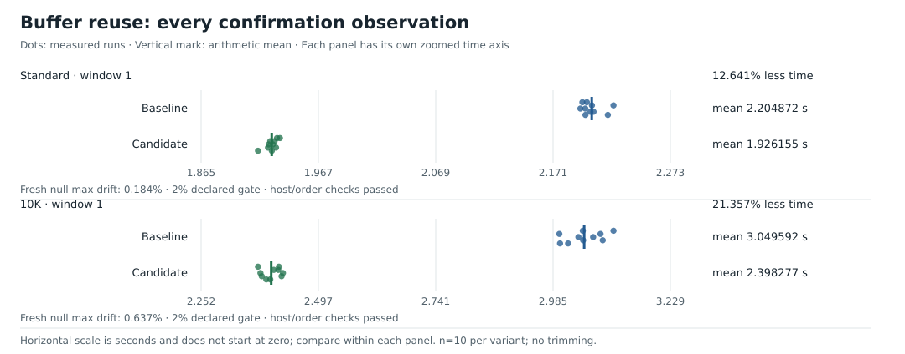
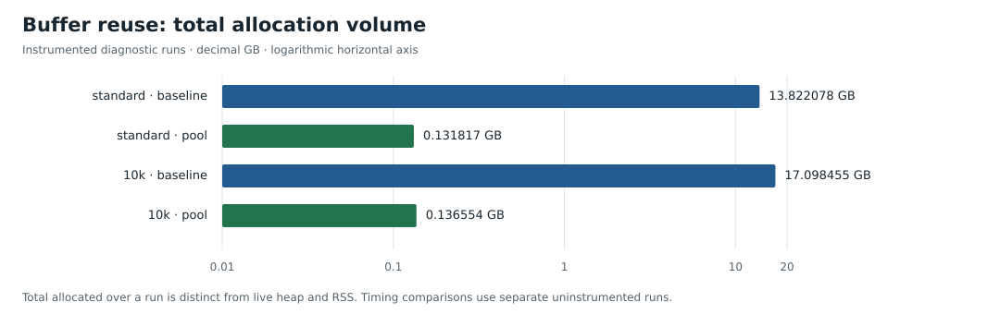

# 7. Reuse a bounded set of buffers

[`57591e7`](https://github.com/lunemec/1brc/commit/57591e78ed9eb68626a5078840576c32f2d0a000)
reuses input buffers instead of allocating a new 6 MiB array for every chunk.
The parser, table, sequential `ReadAt` ranges, and worker count stay fixed.
Workers return each buffer after its final update.

## Lend each buffer to one worker

A pool keeps returned buffers available for reuse.
Only the producer takes buffers and updates the allocation count.
Workers send completed loans back through `recycle`:

```go
type chunkBufferPool struct {
    available chan []byte
    allocated int
    size      int
}

type chunk struct {
    data    []byte
    recycle chan []byte
}
```

The producer follows three rules:

1. If a returned buffer exists, reuse it.
2. If none exists and the count is below the limit, allocate one.
3. Otherwise, wait for a worker to return one.

With sixteen workers and an unbuffered work channel, each worker can hold one chunk.
The producer can hold one additional buffer:

$$
N_{\text{buffers}}\le W+1=17,
\qquad
M_{\text{input buffers}}\le17\times6\ \text{MiB}=102\ \text{MiB}.
$$

That bound covers input arrays, not tables, keys, or total process memory.
Buffers are allocated only as demand grows.
A two-worker example shows how waiting limits allocation:

```text
Producer borrows A → reads → sends A to worker 0
Producer borrows B → reads → sends B to worker 1
Producer borrows C → reads → waits for an available worker
Worker 0 finishes A → returns A → accepts C
Producer next take reuses A
```

## Own the keys before returning the buffer

The parser borrows name bytes, but insertion copies each new key into table-owned memory.
The worker must finish every update before returning the buffer.
It can then safely reuse the same storage:

```text
Buffer A contains:       Oslo;1.2\n
Parser borrows:          "Oslo" within A
Table inserts a clone:   separately owned "Oslo"
Worker finishes update:  count=1, sum=12, min=12, max=12
Worker returns A
Next read overwrites A:  Rome;9.9\n
Table still contains:    "Oslo" and its original accumulator
```

The return restores the full buffer capacity:

```go
c.recycle <- c.data[:cap(c.data)]
```

An EOF read can overwrite only its first `n` bytes.
The producer sends `data[:n]`, so the old suffix stays outside the input view:

```text
Old buffer:       A;1.0\nB;2.0\n...
New read:         C;3.0\n          n=6
Valid chunk view:  C;3.0\n          len=6
Stale suffix:     B;2.0\n...       outside the view
```

The return channel stays open after producer EOF because workers can finish later.
The scalar temperature decoder finishes before release, just like the word decoder.
Ownership tests inspect stored key bytes after poisoning the original buffers.

## Result



| Corpus / window | Fresh buffers | Bounded pool | Runtime reduction |
| --- | ---: | ---: | ---: |
| Standard / 1 | 2.204872 s | 1.926155 s | 12.641% |
| 10K / 1 | 3.049592 s | 2.398277 s | 21.357% |

The instrumented memory runs show:

| Metric | Standard before → pool | 10K before → pool |
| --- | ---: | ---: |
| Total allocated, decimal GB | 13.822078 → 0.131817 | 17.098455 → 0.136554 |
| Automatic GC cycles | 130 → 3 | 152 → 3 |
| Sampled peak RSS, decimal MB | 291.992 → 147.841 | 288.616 → 150.209 |
| Live heap after GC, decimal MB | 0.625 → 0.616 | 0.632 → 0.613 |



Total allocation counts bytes allocated over the run.
Live heap measures reachable bytes, while RSS measures process memory resident in RAM.
The similar final live heap shows that repeated allocation, rather than a permanent leak, was the issue.

The allocation graph uses a logarithmic axis, so bar lengths are not linear ratios.
These diagnostics are separate from the release timing comparisons.
The [acceptance record](../../EXPERIMENTS.md#accepted-bounded-buffer-reuse-2026-10-06) includes controls, exact counts, pool bounds, and the CPU-metric caveat.

[← Previous](06-temperature-word-decoder.md) · [Next: pooled AVX2 →](08-pooled-avx2-scanning.md)
