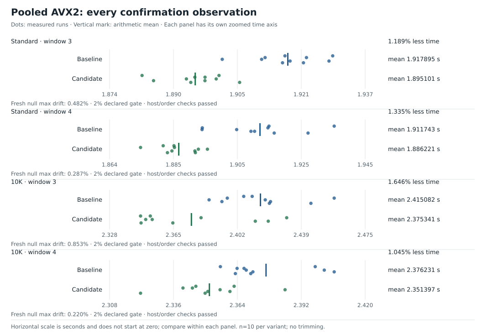

# 8. One delimiter mask for several rows

[`0e5dd35`](https://github.com/lunemec/1brc/commit/0e5dd3528b9423dda9e18e99b131ebe61fbc82cb)
adds AVX2 scanning after buffer reuse.
A vector instruction processes several byte positions together.
Two 32-byte comparisons produce a 64-bit mask, with one bit per semicolon:

```go
func semicolonMask64AVX2(data []byte) uint64 {
    _ = data[63]
    delimiter := archsimd.BroadcastUint8x32(';')
    low := archsimd.LoadUint8x32(data).Equal(delimiter).ToBits()
    high := archsimd.LoadUint8x32(data[32:]).Equal(delimiter).ToBits()
    return uint64(low) | uint64(high)<<32
}
```

`Broadcast` fills every comparison position with `;`.
`Equal` finds matching bytes, and `ToBits` turns their positions into bits.
The worker calls this kernel only with at least 64 remaining bytes, including unaligned starts.

## Consume the positions in order

For a 64-byte teaching block beginning with `A;0.0\nB;1.0\n`:

```text
Bytes:    A ; 0 . 0 \n B ; 1 . 0 \n
Offsets:  0 1 2 3 4  5 6 7 8 9 10 11
Matches:    1           1
Mask:     (1<<1) | (1<<7) = 0x82
```

Trailing-zero count locates the lowest set bit.
`mask &= mask-1` removes that bit:

| Operation | Before | After / result |
| --- | --- | --- |
| Find first set bit | `0x82` | offset 1 |
| Clear lowest set bit | `0x82 & 0x81` | `0x80` |
| Find next set bit | `0x80` | offset 7 |
| Clear lowest set bit | `0x80 & 0x7f` | `0x00` |

The first separator is at offset 1.
After A's newline, the next row starts at 6, so B's separator is `7-6=1` relative to that row.
The worker updates A before B, even when both names are the same station.

## Keep block and row offsets separate

| Variable | Meaning |
| --- | --- |
| `rowStart` | Absolute start of the next row in the chunk |
| `blockStart` | Absolute start of the window that produced the current mask |
| `nextBlock` | Absolute start of the next unscanned 64-byte window |

The absolute separator is `blockStart + bits.TrailingZeros64(delimiters)`.
Subtract `rowStart` before calling `parseLineAtSeparator` on the row view.
For a 100-byte name starting at zero, the separator is window 64's bit 36: `64+36-0=100`.

A temperature can finish beyond the mask's window, but contains no semicolons.
The decoder reads within the chunk and preserves the existing name hash and updates.
If no full window or cached separator remains, `parseLine` handles the tail.

An incomplete row ends processing of that chunk, rather than stopping the worker.
All updates finish before buffer release.
Unsupported builds or CPUs use the pooled scalar parser, selected once per worker.

## Why the scalar control needs an exact mask

[Part 3](03-swar-separator-scan.md) shows that subtraction can invent later match bits through a borrow.
Enumerating all delimiters needs a different formula:

```go
x := word ^ 0x3b3b3b3b3b3b3b3b
low := uint64(0x7f7f7f7f7f7f7f7f)
matches := ^(((x & low) + low) | x | low) & 0x8080808080808080
```

Masking to seven bits limits each byte's sum to 254, so addition cannot carry into the next byte.
A zero byte leaves its high bit clear before inversion.
Nonzero low bits or an original high bit suppress the marker.

This gives an exact control mask.
The scalar batching control still runs slower than production.
Correct mask generation does not guarantee a faster program.

## Result against the normal build

Matching SIMD build flags also changed baseline timing.
The practical comparison therefore uses normal production, with two independent periods per input:



| Corpus / independent window | Normal production | AVX2 | Runtime reduction |
| --- | ---: | ---: | ---: |
| Standard / 3 | 1.917895 s | 1.895101 s | 1.189% |
| Standard / 4 | 1.911743 s | 1.886221 s | 1.335% |
| 10K / 3 | 2.415082 s | 2.375341 s | 1.646% |
| 10K / 4 | 2.376231 s | 2.351397 s | 1.045% |

All four periods pass their declared controls and exact-output comparisons.
The initial decision kept SIMD as research because duplicated paths and experimental compiler support add complexity.
The user then requested promotion of this exact measured version.

Before the pool, SIMD did not meet the gain threshold.
The changed producer behavior justified another test, but does not establish allocation as the sole cause of the different result.
The [promotion record](../../EXPERIMENTS.md#pooled-mask-retries-and-simd-promotion-2026-10-06) keeps all controls and excluded periods.

[← Previous](07-bounded-buffer-reuse.md) · [Next: experiments that did not win →](09-experiments-that-did-not-win.md)
