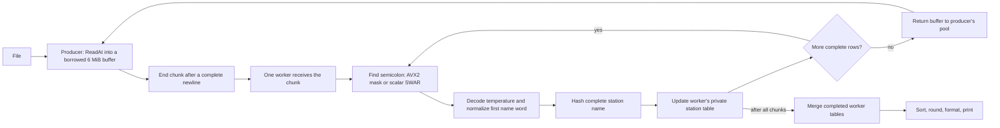

# Making one billion rows faster in Go

Each chapter explains one change with a small example and its measured result.
The series covers `c27aa54` through `0e5dd35`.
The [main README](../../README.md) remains the benchmark manual.

| Part | Topic |
| --- | --- |
| [0](00-first-go-solution.md) | The first Go solution |
| [1](01-correctness-and-early-changes.md) | Correctness fixes |
| [2](02-measuring-improvements.md) | Measuring a change |
| [3](03-swar-separator-scan.md) | Eight-byte delimiter scans |
| [4](04-robust-station-table.md) | The station table |
| [5](05-reusing-the-first-word.md) | Reusing the loaded name word |
| [6](06-temperature-word-decoder.md) | Temperature decoding |
| [7](07-bounded-buffer-reuse.md) | Buffer reuse |
| [8](08-pooled-avx2-scanning.md) | AVX2 delimiter masks |
| [9](09-experiments-that-did-not-win.md) | Rejected experiments |

## The input and data flow

These rows come from the [ten-row sample](../../test/resources/samples/measurements-10.txt):

```text
Halifax;12.9
Zagreb;12.2
Cabo San Lucas;14.9
Adelaide;15.0
Ségou;25.7
```

Each row contains a station name and a temperature.
The program calculates count, sum, minimum, and maximum for each station.
It prints sorted names with `minimum/mean/maximum`, rounded to one decimal digit.

Names contain 1–100 UTF-8 bytes, and temperatures range from `-99.9` through `99.9`.
The input allows up to 10,000 distinct stations.
Workers process chunks of input bytes and keep separate station tables:



## The results


Each bar compares a change with its own baseline in the same measurement period.
The gains are not cumulative.
[Part 2](02-measuring-improvements.md) explains the method and its limits.

The [data guide](data/README.md) links the 280 timing observations and memory measurements.
It also gives the commands that recreate the figures and arithmetic traces.
Rows such as `Oslo;-12.6\n` are teaching examples from the source and tests.
