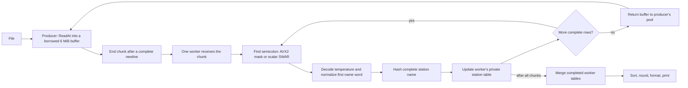
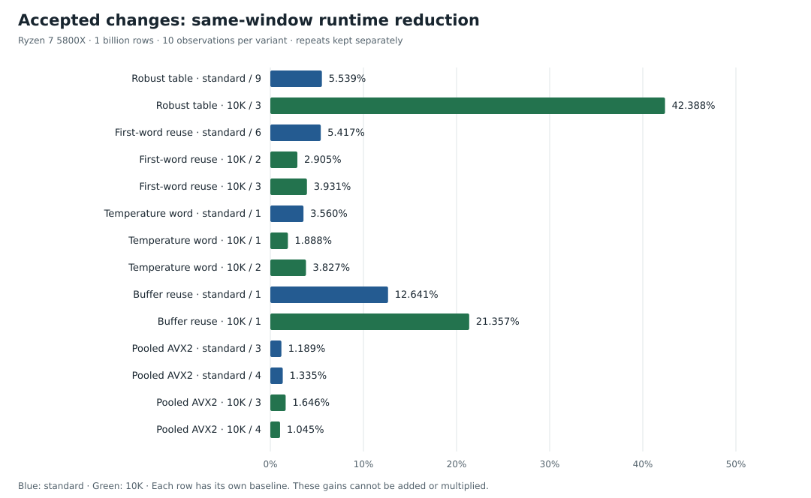

# Making one billion rows faster in Go

This series explains how we made the Go program faster. Each chapter follows
one change from its source code to its measured result. You need to know how
to read a small Go function. Each chapter explains the technical terms needed
for its change.

A Git commit records a version of the project. The series follows the order
of commits from the first Go version, `c27aa54`, through `0e5dd35` (pooled AVX2
scanning). The [main README](../../README.md) remains the benchmark manual.
A benchmark measures how long a program takes. Later changes need separate
chapters after their code and results are ready.

## Read the story in order

| Part | Question it answers | Revision |
| --- | --- | --- |
| [0. The first Go solution](00-first-go-solution.md) | How do chunks, private tables, integer temperatures, and a custom parser fit together? | `c27aa54` |
| [1. Making the answer correct](01-correctness-and-early-changes.md) | What changed for short rows, merging, rounding, iteration, and map values? | `9233101` → `83098c9`, then harness fixes |
| [2. Learning to measure](02-measuring-improvements.md) | How do we distinguish a faster program from a quieter machine? | `0f6e86d` → `c890897`, with later controls |
| [3. Eight bytes at a time](03-swar-separator-scan.md) | How does ordinary integer arithmetic find a semicolon? | `84e642c` |
| [4. A table built for repeated names](04-robust-station-table.md) | Why do full fingerprints, inline statistics, and a small common path help? | `f8a90a5` |
| [5. Keep the word we already loaded](05-reusing-the-first-word.md) | How do we reuse parser work without hashing temperature bytes? | `51e20a1` |
| [6. Decode a temperature with one word](06-temperature-word-decoder.md) | How do shifts, masks, a multiply, and a sign mask produce `-126`? | `ef7418a` |
| [7. Stop allocating the input again](07-bounded-buffer-reuse.md) | Who owns a buffer, and when is it safe to reuse it? | `57591e7` |
| [8. One mask for several rows](08-pooled-avx2-scanning.md) | How do vector comparisons become delimiter positions and row updates? | `0e5dd35` |
| [9. Useful ideas that did not win](09-experiments-that-did-not-win.md) | Why were plausible alternatives rejected, and why did SIMD get a second chance? | Retained experiment records |

The series uses the order of parent commits in Git. Some dates differ from
that order. The November 2024 code update follows an April 2025 README commit.
These dates do not establish the order of development.

## The task, with real input

UTF-8 represents text as bytes. Each row contains a UTF-8 station name and a
temperature with exactly one decimal digit. A semicolon separates these values.
A newline ends the row. These rows come from the stored
[ten-row sample](../../test/resources/samples/measurements-10.txt):

```text
Halifax;12.9
Zagreb;12.2
Cabo San Lucas;14.9
Adelaide;15.0
Ségou;25.7
```

For each station, we store the count, sum, minimum, and maximum. The mean is
the sum divided by the count. The program sorts station names and prints
`minimum/mean/maximum` with one decimal digit.

Names contain 1–100 bytes. Temperatures range from `-99.9` through `99.9`.
The challenge allows up to 10,000 distinct stations. The table stores one entry
per distinct station, even when the input contains a billion rows.

A buffer is memory that holds input bytes. A chunk is one section of those
bytes. A worker processes chunks and stores each station's results. The
following diagram shows the data flow at the documented commit. The linked
chapters explain its parser, table, and buffer pool.



A teaching fixture is input chosen to explain behavior. For example,
`Oslo;-12.6\nParis;0.0\n` comes from the source comments and tests. It does not
represent an observed weather measurement. Chapters identify teaching fixtures,
stored samples, and benchmark results separately.

## What the measurements say

The series explains six accepted changes. They cover delimiter scanning, the
station table, reuse of a loaded word, temperature decoding, buffer reuse, and
AVX2 scanning. The first Go version already included several ways to reduce
work. Git does not contain a separate measured comparison for each early choice.

Runtime is the time that a program takes. A baseline is the version used for
comparison. A candidate is the version that we test. A window is one period
of measurements under the same controls.



The chart includes all fourteen complete windows for the five Linux changes.
It includes both independent repeats for small effects. Each bar compares a
candidate with its own baseline from the same window.

SWAR uses one integer to compare several bytes.
The earlier SWAR change reports 9.64% / 7.12% less runtime for the standard /
10K inputs in a separate session. A corpus is the complete input file for a
test. Its original timing archive is unavailable here.
[Part 3](03-swar-separator-scan.md) preserves this result as a historical summary.

Results from different machines or windows cannot establish a change's effect.
We do not add or multiply these gains to claim a total improvement.
[Part 2](02-measuring-improvements.md) explains the controls and the difference
between runtime reduction and speedup.

## Evidence you can inspect

The series includes [280 individual measured runs](data/timings.json) from
fourteen valid windows. Each window retains its original A/B/B/A groups of runs.
The series also includes [memory measurements for buffer reuse](data/memory.json).

These extracts preserve file identities, build configuration, controls, output
results, and summary measurements. The large local `results/` archives remain
outside Git. [The data guide](data/README.md) explains each extract and its limits.

[Source commands](data/history.md) show each implementation and its actual
parent commit. You can read these versions locally. This also works for commits
that we did not yet upload to the remote repository.

Run the documentation tools from the repository root:

```sh
python3 docs/optimization-blog/tools/generate_assets.py
python3 docs/optimization-blog/tools/trace_examples.py
```

The first command makes sure that the observations match the stored summaries.
It then recreates the figures and [measurement table](data/measurements.md).
The second command prints the arithmetic examples and makes sure that their
results match the expected values. These commands do not run performance tests
or read a billion-row input file. Both scripts use only Python's standard library.

## Continuing the series

When a change is ready, add a chapter for it. Preserve earlier chapters as
records of earlier versions. Record its commit and the version used for
comparison. Explain the work that it removes. Show the data flow before and
after the change.

Describe the conditions that keep the answer correct. Include the measurements
and their controls. Include each required independent repeat. Keep unsuccessful
experiments when they explain the decision.

Use teaching inputs that readers can follow by hand. For bit arithmetic, show
the byte order and each result between steps. Explain each mask and constant.
Describe the alternative path for bytes near the end of a buffer.

Before you add a figure, include the original observations and their source
records. When implementation work ends, use this series to help rewrite the
main README.
